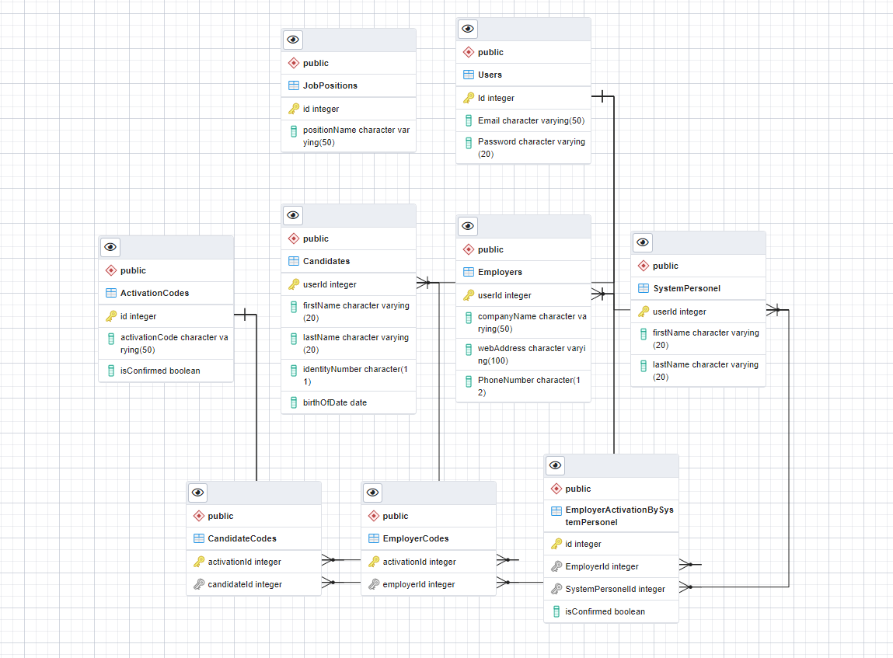

# HRMS.PostgreSQL (Human Resource Management System)
### PostgreSQL - Database
* * *
### ER AÇIKLAMASI:
  - <b> Users </b> <i>(Bütün kullanıcıların base tablosu)</i>
    - <b> Candidates </b> <i>(İş arayanlar)</i>
    - <b> SystemPersonel</b> <i>( Sistem çalışanları)</i>
      - <b> EmployerActivationBySystemPersonel</b> </i> (System personeli tarafından iş verene onay verilmesi)</i> 
  - <b> ActivationCodes </b> <i> ( CondidateCodes ve EmployerCodes için base tablo)</i>
    - <b> CondidatesCodes</b> <i>( iş arayanların aktivasyonu)</i>
    - <b> EmployerCodes </b><i>  (iş verenlerin aktivasyonu)</i>
  - <b> JobPositions </b> <i>(Genel iş pozisyonları tablosu) 
  * * *
  

